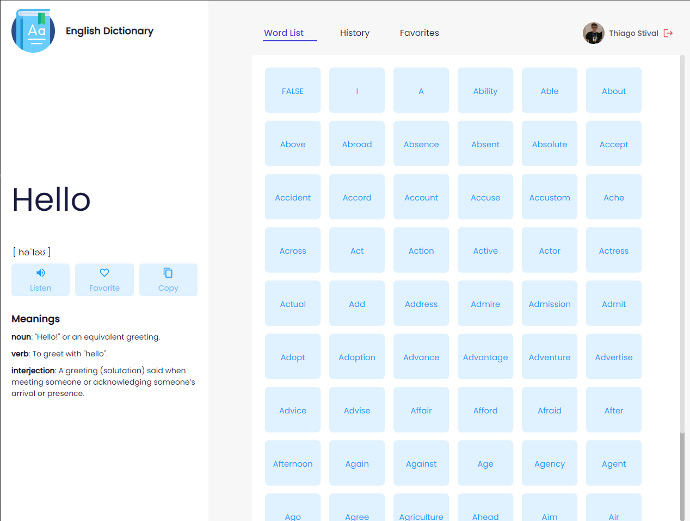
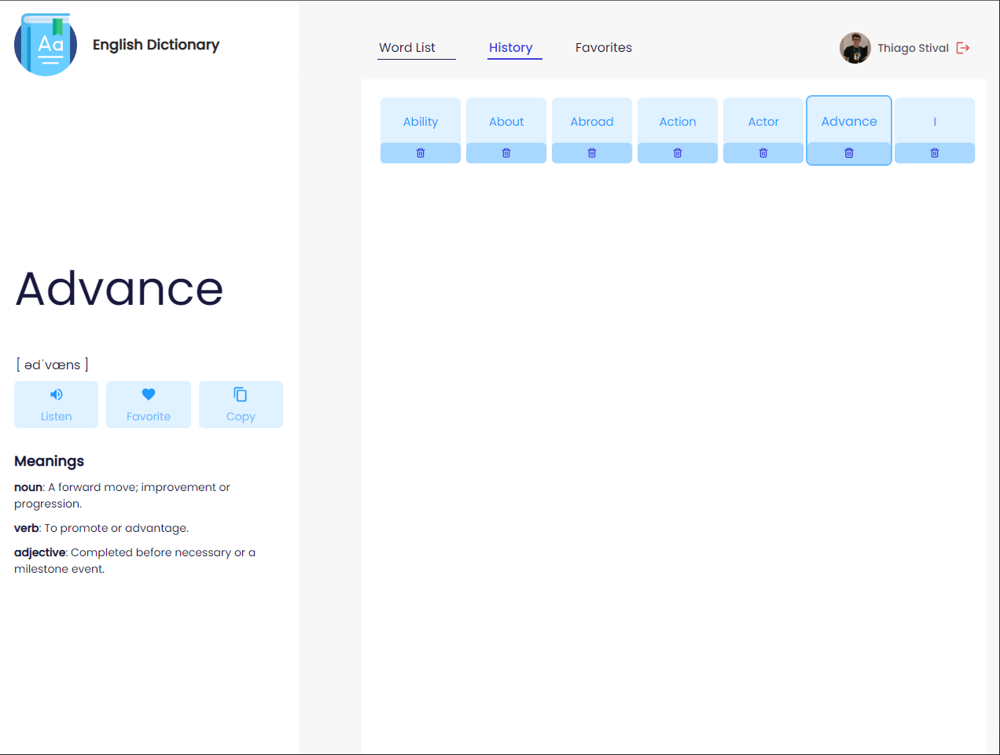
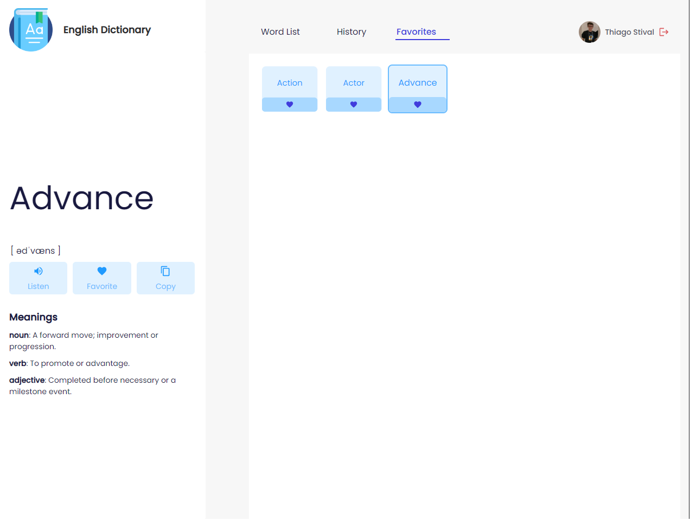
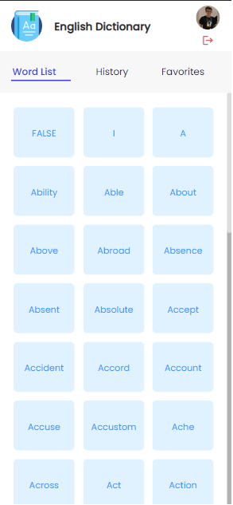
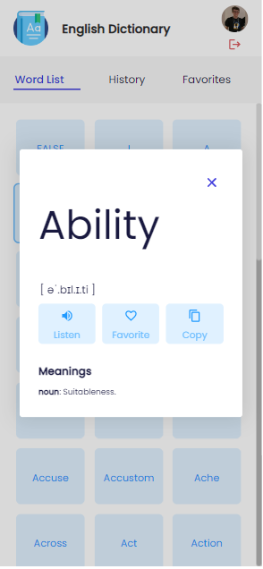
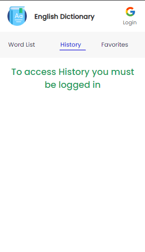

# English Dictionary App

  

  <h2>📖<b>Welcome to your English dictionary</b>📖</h2>

 <a href="#project">👉 Project</a>
 <a href="#technologies">👉 Technologies</a>
 <a href="#execution">👉 Execution</a>
 <a href="#more">👉 More</a>

<h2 id="project">:muscle: Project</h2>

- Application where you can find a wide variety of English words.

- In the app you have the possibility to view a large list of words and information about each word, such as usage examples and their pronunciation.

- It is also possible to login with google and thus view the history of words seen and also favorite them.

- Application developed following the <b>Mobile First</b> model

<h2 id="technologies">:rocket: Used Technologies</h2>

This project was developed with the following technologies:

- [Node 16.17](https://nodejs.org/en/)
- [React 18.2](https://reactjs.org/)
- [TypeScript 4.6.4](https://www.typescriptlang.org/)
- [Vite](https://vitejs.dev/)
- [Docker](https://docs.docker.com/)
- Others:
  - [React Icons](https://react-icons.github.io/react-icons)
  - [Styled-Components](https://github.com/styled-components/styled-components)
  - [Axios](https://axios-http.com/docs/intro)
  - [React Query](https://react-query-v3.tanstack.com/)
  - [Firebase](https://firebase.google.com/docs?gclid=CjwKCAjwg5uZBhATEiwAhhRLHph3fnjC04qJosdpJO4csja2yAkbQ8Asp433XrJI_Klarx5bLqumrhoCWG8QAvD_BwE&gclsrc=aw.ds)
  - [Jest](https://jestjs.io/)
  - [SWC](https://swc.rs/docs/usage/jest)
  - [Testing-Library](https://testing-library.com/docs/)
  - [ESLint](https://eslint.org/)
  - [Prettier](https://prettier.io/)
  - [Husky](https://typicode.github.io/husky/#/)
  - [Lint-Staged](https://github.com/okonet/lint-staged)
  - [commitlint](https://commitlint.js.org/#/)
  - [conventional commits](https://www.conventionalcommits.org/en/v1.0.0/)

<h2 id="execution">👨🏻‍💻 Execution</h2>

To run the project:

- Clone the project by running this command in the terminal `git clone <repo_url>`;
- Open the project folder in the terminal and run:
  - If you have <b>Docker</b>, you can also run the project more easily:
    - Linux: `docker compose up`
    - Windows: `docker-compose up`
    - And open url: `http://localhost:3000`
  - But you can also run it the traditional way:
    - `yarn` or `npm install` -> To install all dependencies;
    - `npm prepare` -> To configure the husky;
    - `yarn dev` or `npm run dev` -> To run the project;
    - And open the url is present in terminal;
- To run the tests just run `yarn test` or `npm run test`.

<h2 id="more">🌆 More Images</h2>

  
  <b>
History of visited words
</b>

  
  <b>
Favorite words list
</b>

  
  <b>
Word list in responsive mode
</b>

  
  <b>
Viewing a word in responsive mode
</b>

  
  <b>
Trying to access history tab or favorites when not logged in
</b>

<h2 id="more">🖇 More</h2>

Fork the project and contribute.

And use and abuse the will!😎😎😎

<h2 id="author">👨🏻‍🎓 Author</h2>

Thiago Stival

